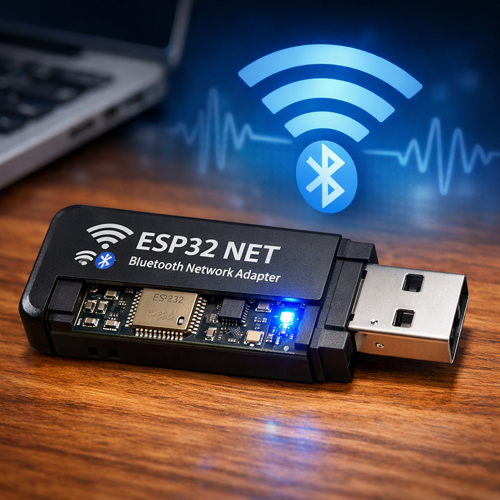

# Distributed Network Gateway (DistNetGtwy)



DistNetGtwy is an ESP32-S3 based gateway that connects a host computer to the mesh/signalling side of the system.
It exposes a USB network interface to the host and serves a REST API implemented in MicroPython.

## What This Gateway Does

- Enumerates as a USB NIC (ECM/RNDIS depending on host stack support).
- Uses static IPv4 addressing on that USB link.
- Runs a REST server on port `8080`.
- Provides a command-style API (`/command`) for host control and status.

## Connection Model

Data path:

1. Host computer connects over USB to the ESP32-S3 gateway.
2. Gateway appears as a host-visible network adapter.
3. Host sends HTTP requests to the gateway REST API.
4. Gateway command handlers return runtime state and, in full deployments, bridge into mesh-side signalling.

## Network Parameters (Host <-> Gateway USB Link)

- Host IP: `192.168.137.1/24`
- Gateway IP: `192.168.137.2/24`
- Hostname (mDNS): `mesh-gateway.local`
- Base URL: `http://mesh-gateway.local:8080`

If mDNS is unavailable on your host, use `http://192.168.137.2:8080`.

## REST API (Implemented)

API spec file: `DistNetGtwy/spec/api.md`

### `GET /health`

Returns service health/version:

```json
{
  "ok": true,
  "service": "mesh-gateway",
  "version": "1.0.0"
}
```

### `POST /echo`

Request:

```json
{
  "message": "hello"
}
```

Response:

```json
{
  "ok": true,
  "echo": "hello"
}
```

### `POST /command`

Request envelope:

```json
{
  "cmd": "status",
  "args": {}
}
```

Implemented `cmd` values:

- `status`
- `echo`

Unknown commands return:

```json
{
  "ok": false,
  "error": "unknown_command",
  "cmd": "<name>"
}
```

## Host Computer Quick Start

After connecting USB and ensuring the NIC is up:

```bash
curl -s http://mesh-gateway.local:8080/health
curl -s -X POST http://mesh-gateway.local:8080/command \
  -H 'Content-Type: application/json' \
  -d '{"cmd":"status","args":{}}'
```

Or use the helper CLI:

```bash
python3 DistNetGtwy/tools/gatewayctl.py health
python3 DistNetGtwy/tools/gatewayctl.py status
python3 DistNetGtwy/tools/gatewayctl.py echo "hello"
```

## Runtime Components

- `DistNetGtwy/micropython_app/main.py`
  - Brings up `usbnet` with static IP settings.
  - Starts REST server on `0.0.0.0:8080`.
- `DistNetGtwy/micropython_app/rest_server.py`
  - Implements `/health`, `/echo`, and `/command`.
- `DistNetGtwy/firmware/components/mp_usbnet_plugin/`
  - MicroPython `usbnet` module (`start`, `stop`, `is_up`).
  - USB netif glue hook for TinyUSB/lwIP integration.

## Bluetooth / Mesh-Side Integration

DistNetGtwy is intended to bridge host commands into the wireless signalling domain (Bluetooth/mesh side).
At the moment, this repository's gateway app implements the host-side REST/control surface and USB network bring-up.

Current status:

- Implemented:
  - USB NIC control path (`usbnet.start(...)`).
  - Host REST control API.
- Not yet implemented in gateway app:
  - Concrete Bluetooth transport handlers in `micropython_app`.
  - Command handlers that forward into a live Bluetooth mesh.

Where to extend:

1. Add Bluetooth/mesh transport module(s) in `DistNetGtwy/micropython_app/`.
2. Add new `cmd` handlers in `rest_server.py` that call that transport.
3. Keep `/command` envelope stable so host tooling remains compatible.

## Firmware Integration Notes

`mp_usbnet_plugin` includes a control path and static IPv4 setup.
USB frame TX/RX bridge details are described in:

- `DistNetGtwy/firmware/components/mp_usbnet_plugin/README.md`

If you are integrating on a new board/stack:

1. Confirm TinyUSB network class (ECM/NCM/RNDIS) support.
2. Confirm `esp_netif` is created and assigned static IP values above.
3. Confirm mDNS advertises `mesh-gateway.local`.
4. Verify `GET /health` from the host before adding mesh forwarding logic.
